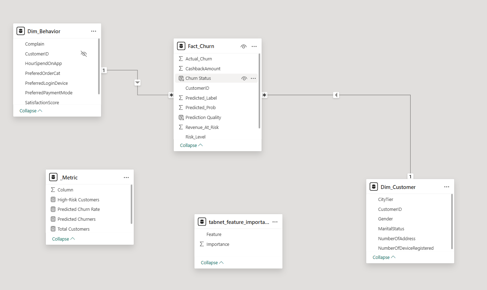
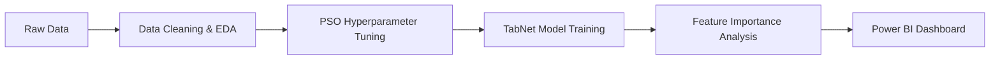

# 🚀 AI-Powered Customer Retention System (TabNet + PSO)

## 📌 Business Overview

In the competitive e-commerce landscape, retaining high-value customers is critical. This project delivers an end-to-end analytics solution to predict customer churn, quantify financial risks, and support data-driven retention strategies.

---

## 🛠 Tech Stack

### 🔹 Data Science & Machine Learning

* Python (Pandas, NumPy, PyTorch)
* TabNet (Deep Learning)
* Particle Swarm Optimization (PSO)
* Scikit-learn
* Explainable AI (Feature Importance)

### 🔹 Data Engineering

* SQL
* Star Schema Design
* ETL Pipeline

### 🔹 Business Intelligence

* Power BI
* DAX
* What-if ROI Analysis
* Interactive Dashboard Design

---

## 🏗 Data Architecture (Star Schema)



*The project utilizes a Star Schema architecture to optimize analytical queries and improve dashboard performance.*

---

## 🧠 AI Pipeline



---

## 📈 Key Insights & Business Impact

* Identified high-risk customers contributing to significant Revenue at Risk (RaR).
* Detected major churn drivers such as low satisfaction score and complaint history.
* Developed an interactive What-if ROI Analysis dashboard to simulate retention campaign profitability.
* Combined Machine Learning and Business Intelligence into a unified analytics workflow.

---

## 📊 Dashboard Preview


---

## 📂 Repository Structure

```text
project/
│
├── data/              # Processed datasets for analytics & BI
├── notebooks/         # ML workflow notebooks
├── dashboard/         # Power BI dashboard (.pbix)
├── images/            # Dashboard screenshots & schema images
├── sql/               # SQL scripts & data warehouse design
└── README.md
```

---

## 🎯 Project Objectives

* Predict customer churn probability using AI models.
* Analyze customer behavior and business risk.
* Visualize actionable insights through Power BI dashboards.
* Support strategic retention decision-making.

---

## 👨‍💻 Author

**Xuân Toàn**
Final-year Financial Technology Student
Aspiring Data Analyst | Machine Learning Enthusiast
